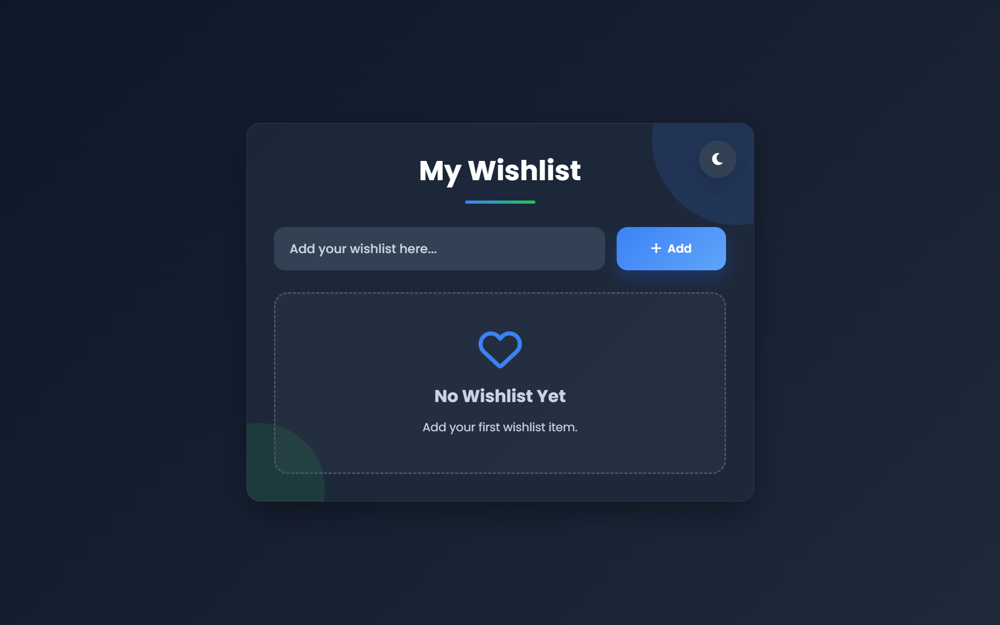
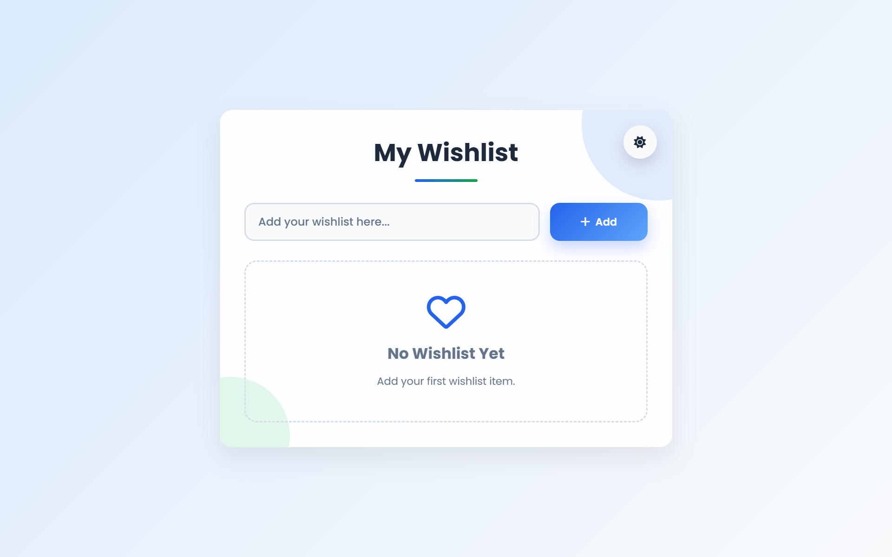

# 💖 Wishlist App

A modern and responsive **Wishlist Application** built using **HTML, CSS, and JavaScript**. It allows users to create, manage, and organize their wishlist with a clean interface, dark/light theme support, and persistent data using Local Storage.

---

## 🌐 Live Demo

🔗 Add your deployment link here.

---

# 📖 Overview

Wishlist App is a lightweight web application that helps users keep track of items they wish to purchase or remember. The application provides a modern user interface with smooth animations, theme switching, and local data persistence, ensuring that wishlist items remain available even after refreshing the browser.

---

# ✨ Features

- ➕ Add wishlist items
- ❤️ Manage your personal wishlist
- ✅ Mark items as completed
- 🗑 Delete wishlist items
- 💾 Local Storage support
- 🌙 Dark Mode
- ☀️ Light Mode
- 📱 Responsive Design
- 🎨 Modern Glassmorphism UI
- ⚡ Smooth animations and transitions
- ♿ Accessible focus styles

---

# 🛠️ Tech Stack

### Frontend

- HTML5
- CSS3
- JavaScript (ES6)

### Browser Features

- DOM Manipulation
- Event Handling
- Local Storage API
- CSS Variables
- Flexbox
- Media Queries

### Tools

- VS Code
- Git
- GitHub

---

# 📂 Project Structure

```text
Wishlist-App/
│
├── index.html
├── style.css
├── script.js
├── README.md
└── assets/
    └── logo.png
    └── screenshots/
```

---

# 🚀 Getting Started

## Clone Repository

```bash
https://github.com/abhishekkjaiml/JavaScript.git
```

---

## Navigate to Project

```bash
cd wishlist-app
```

---

## Open the Project

Simply open **index.html** in your browser.

or use VS Code Live Server.

---

# 📸 Screenshots

Create a screenshots folder inside assets.

```text
assets/
└── screenshots/
    ├── home-dark.png
    ├── home-light.png
    ├── empty-state.png
    └── wishlist.png
```

Example

```md
## Dark Mode



## Light Mode


```

---

# 📚 Concepts Used

- DOM Manipulation
- Event Delegation
- Local Storage
- JavaScript Objects
- Arrays
- Array Methods (`map()`, `filter()`)
- UUID Generation
- CSS Variables
- Theme Switching
- Responsive Web Design

---

# 🎯 Learning Outcomes

Through this project, I learned:

- Working with the DOM
- Handling user events
- Building reusable JavaScript functions
- Using Local Storage for persistent data
- Creating responsive layouts
- Implementing Dark and Light themes
- Managing application state
- Writing clean and maintainable code

---

# 🚀 Future Improvements

- ✏️ Edit wishlist items
- 🔍 Search functionality
- 🏷 Category management
- 📊 Wishlist statistics
- ⭐ Priority levels
- 📅 Due dates
- 📦 Backend integration
- 🔐 User authentication
- ☁️ Cloud database support
- 🔔 Toast notifications

---

# 🚀 About Me

Hi, I'm **Abhishek Kumar**, a passionate Computer Science & Engineering student and aspiring Full Stack Developer with a strong interest in building modern, responsive, and user-friendly web and mobile applications. I enjoy turning ideas into real-world projects while continuously learning new technologies and improving my development skills.

### 💼 Areas of Interest

- 🌐 Frontend Development
- ⚛️ React.js Development
- 📱 React Native Development
- 🚀 MERN Stack Development
- 🎨 UI/UX Design
- 💻 Web Application Development

### 🌐 Connect with Me

- **GitHub:** https://github.com/abhishekkjaiml
- **LinkedIn:** https://www.linkedin.com/in/abhishek-kumar-jaiswar-35632b2b7/
---

# ⭐ Show Your Support

If you found this project helpful, consider giving it a ⭐ Star on GitHub.

---

<p align="center">
Made with ❤️ using HTML, CSS & JavaScript
</p>
